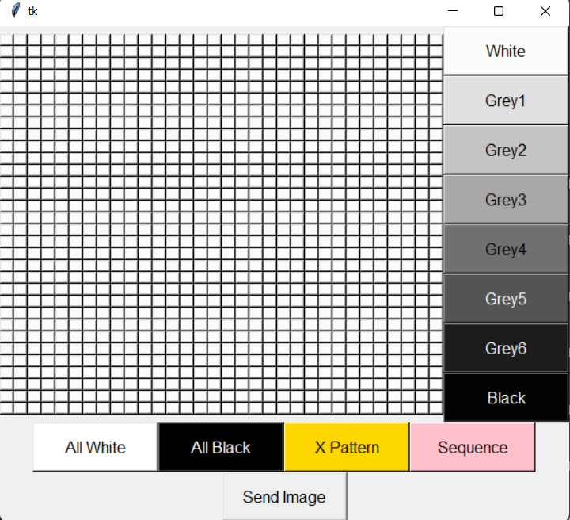

# Pixel Tint 32 x 32 GUI

## First look of Pixel Tint
<br>



## Purpose of the 32 x 32 GUI
Our objective is to create a 32 by 32 Pixel-Tint System Graphical User Interface that enables users to colour the grid, create patterns and sequence using the different shades of grey.

---

### How it works:
>If a user clicks a specific shade from the colour section on the right and then pressing one of the buttons from the 32x32 grid will change to its colour.

### **gif image

**Pattern Section:**
<br>
<br>
"All White" Button


<br>


# Getting started

>Import tkinter library into the file and create a GUI application window on a main event loop

```
from tkinter import *

main = Tk()

main.mainloop()
```

## Use of Frame Statement

 >Create frames to separate sections of the main window: 
 <br>
 - Frame 1(32x32 Grid)
 <br>
  - Frame 2 (Colour Selection Bar)
  <br>
  - Frame 3 (Patterns Bar)
  <br>
  - Frame 4 (Send Image Button).

```
#32x32 btn
frame1 = Frame(main) 
frame1.grid(row=0, column=0)

#shades btn
frame2 = Frame(main) 
frame2.grid(row=0, column=1)

#pattern btns
frame3 = Frame(main)
frame3.grid(row=1, columnspan=2)  

#send btn
frame4 = Frame(main)
frame4.grid(row=2, columnspan=2)

```

### *insert image here of the frames

# How to code the Pixel Tint

## 32 by 32 Grid:

>Using the Nested For Loop statement, it will create a two dimentional 32 x 32 grid using rows and columns.
<br>
<br>
i=rows,
j=columns
```
button = [[j for j in range(32)] for i in range(32)]

value = [[0 for j in range(32)] for i in range (32)]

for i in range (32):
  for j in range (32):
    button[i][j] = Button(frame1, font=("Calibri, 5"), bg='grey99', width=2, height=1, command=lambda r=i, c=j:colourbtn(r, c))
    button[i][j].grid(row=i, column=j)

```
>The "button" variable 

# insert image here for the grid


## Colours Selection Section
>Create 8 different Tkinter buttons of the different shades of grey for the user to select to colour the squares in the grid.

```
white = Button(frame2, text="White", font=("Calibri, 12"), bg='grey99', width=13,height=2, command=lambda m=0:change_colour(m))
white.grid(row=0, column=0)
grey1 = Button(frame2, text="Grey1", font=("Calibri, 12"), bg='grey88', width=13, height=2, command=lambda m=1:change_colour(m))
grey1.grid(row=1, column=0)
grey2 = Button(frame2, text="Grey2", font=("Calibri, 12"), bg='grey77', width=13, height=2, command=lambda m=2:change_colour(m))
grey2.grid(row=2, column=0)
grey3 = Button(frame2, text="Grey3", font=("Calibri, 12"), bg='grey66', width=13, height=2, command=lambda m=3:change_colour(m))
grey3.grid(row=3, column=0)
grey4 = Button(frame2, text="Grey4", font=("Calibri, 12"), bg='grey44', width=13, height=2, command=lambda m=4:change_colour(m))
grey4.grid(row=4, column=0)
grey5 = Button(frame2, text="Grey5", font=("Calibri, 12"), bg='grey33', fg='white', width=13, height=2, command=lambda m=5:change_colour(m))
grey5.grid(row=5, column=0)
grey6 = Button(frame2, text="Grey6", font=("Calibri, 12"), bg='grey11', fg='white', width=13, height=2, command=lambda m=6:change_colour(m))
grey6.grid(row=6, column=0)
black = Button(frame2, text="Black", font=("Calibri, 12"), bg='grey1', fg='white', width=13, height=2, command=lambda m=7:change_colour(m))
black.grid(row=7, column=0)

```

## Pattern bar
This chunk of code provides the pattern bar.

### All white button
```
#all white button
allwht = Button(frame3, text='All White', font = ("Calibri, 12"), bg='white',width = 13, height = 2,command = allwhite)
allwht.grid(row=0, column=0)
```
Insert image of all white here

### All black button
```
#all black button
allblk = Button(frame3, text='All Black', font = ("Calibri, 12"), bg='Black',fg = 'white',width = 13, height = 2, command = allblack)
allblk.grid(row=0, column=1)
```
insert image of all black

### Cross pattern
```
#cross pattern
pattern1 = Button(frame3, text="Pattern 1",font= ("Calibri, 12"), bg='gold', width=13, height=2, command=pat1)
pattern1.grid(row=0, column=2)
```

Insert image of cross pattern here

### Sequence button
```
#sequence button
pattern2 = Button(frame3, text='Pattern 2', font = ("Calibri, 12"), bg='pink',fg = 'black',width = 13, height = 2,command = pat2)
pattern2.grid(row=0, column=3)
```

Insert image of sequence pattern here


## Send image button
This button will send the data of the pattern

```
send = Button(frame4, text="Send Image", font= ("Calibri, 12"), width=13, height=2, command=sendImage )
send.grid(row=0, column=0)
```
insert image of data output here


## 

