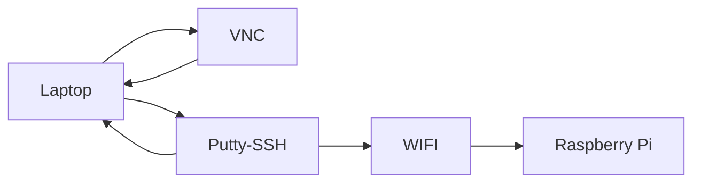
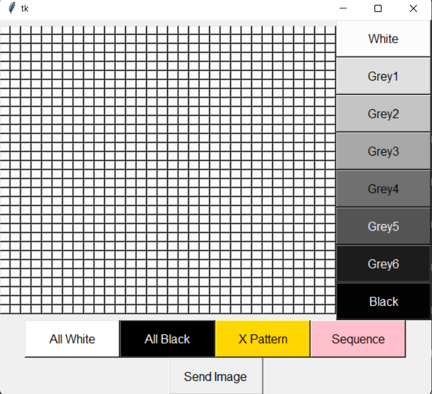
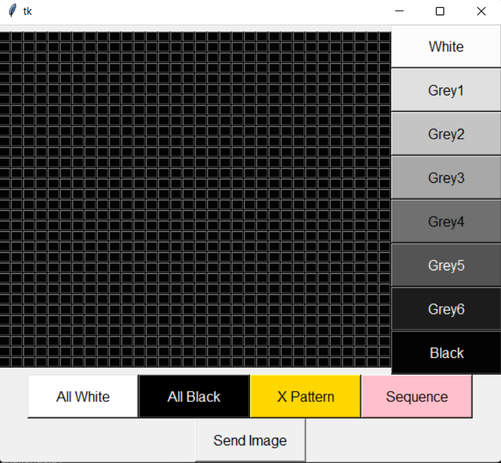
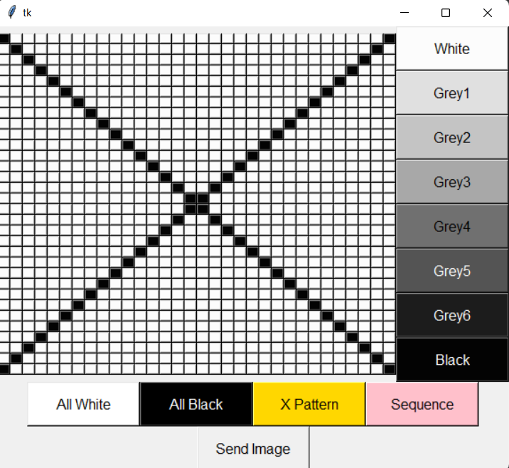
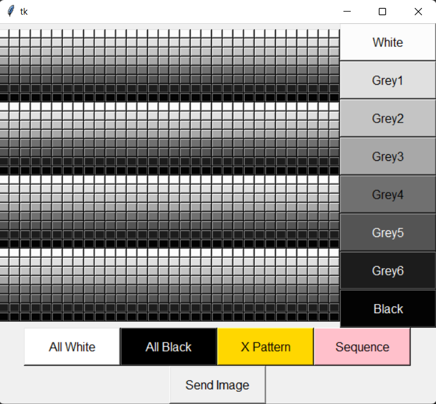
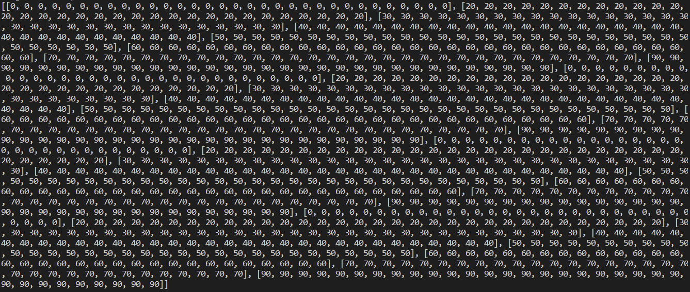
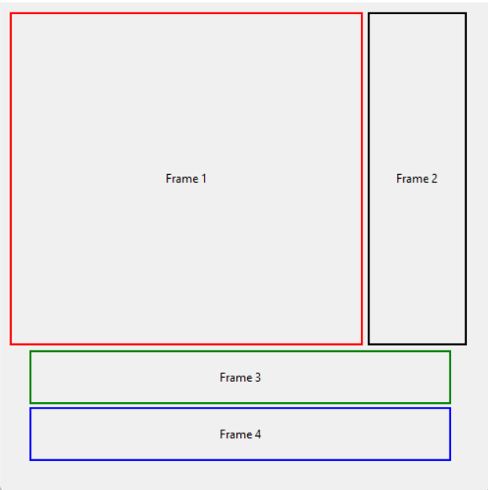
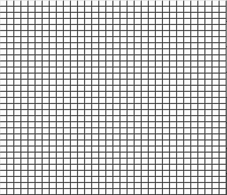
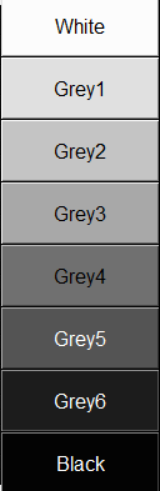
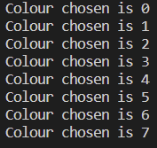

# Pixel Tint 32 x 32 GUI
Our objective is to create a 32 by 32 Pixel-Tint System Graphical User Interface that enables users to colour the grid, create patterns and sequence using the different shades of grey. Sending the image after will output the values of the buttons.

# Hardware information
Hardware: Raspberry Pi Model B(4GB) <br>
Operating System: Raspbian Buster Full
<br>

---

## Getting the raspberry pi connected



## Initial boot of the raspberry pi
---
1. **Secure Shell (SSH)** into Raspberry Pi using **Putty**
```
Hostname: pi@ip_address
Port: 22
Password: (enter your password here)
```

2. After logging in, update and upgrade raspberry pi
```
sudo apt update
sudo apt upgrade
```

## Configuring the pi
---
>Enabling SSH
```
sudo raspi-config
```

Select `Interface Options` <br>
Select `P2 SSH`

>Enabling VNC
```
sudo raspi-config
```
Select `Interface Options`<br>
Select ` P3 VNC`

<br>
Now, we are ready to begin.
<br>

---


# First look of Pixel Tint

<br>
*Screenshot of the final 32x32GUI*

---

### How it works:
If a user clicks a specific shade from the colour section on the right and then pressing one of the buttons from the 32x32 grid, it will change to the colour.

<br>
*Example of how the GUI works*

## Pattern Section
**"All White" Button:**

<br>
*Output of all white button*

It turns all the buttons in the 32x32 grid into the lightest shade (White).<br> It is also used to reset the grid back to white.

---

**"All Black" Button:**

<br>
*Output of all black button*

It turns all the buttons in the 32x32 grid into the darkest shade (Black).

---

**"X Pattern" Button:**

<br>
*Output of X pattern button*

It turns the 32x32 grid into a cross shape using the black shade.

---

**"Sequence" Button:**

<br>
*Output of Sequence button*
<br>
The 32x32 grid turns into a faded sequence of the shades.

---

**"Send Image" Button:**

*Output values from Send Image button (All White)*

*Output values from Send Image button (All Black)*

*Output values from Send Image button (All X Pattern)*

<br>
*Output values from Send Image button (Sequence)*

It outputs the List of List degree value of the shade colour from the 32x32 grid in the terminal section.

<br>
<br>

# Getting started

>First and most importantly, we have to import tkinter library into the file and create a GUI application window on a main event loop

```
from tkinter import *

main = Tk()

main.mainloop()
```

## Use of Frame Statement

 >Next we created frames to separate the main window into containers like section to group and organize the widget layout.
<br>

We divided them into four sections:
 <br>
 - Frame 1(32x32 Grid)
 - Frame 2 (Colour Selection Bar)
 - Frame 3 (Patterns Bar)
 - Frame 4 (Send Image Button).

```
#32x32 btn
frame1 = Frame(main) 
frame1.grid(row=0, column=0)

#shades btn
frame2 = Frame(main) 
frame2.grid(row=0, column=1)

#pattern btns
frame3 = Frame(main)
frame3.grid(row=1, columnspan=2)  

#send btn
frame4 = Frame(main)
frame4.grid(row=2, columnspan=2)
```
A visual representation of how we want each sections to look like:

<br>
*Example of the frame*
<br>

# How to code the Pixel Tint System

## 32 by 32 Grid Section:
First make a variable called "button" where it creates a list of list of the 1024 tkinter buttons 

<br>

>i=rows,
j=columns
```
button = [[j for j in range(32)] for i in range(32)]
```
Then using the Nested For Loop statement, this will create a two dimentional 32 x 32 grid in the form of rows and columns.

```
for i in range (32):
  for j in range (32):
    button[i][j] = Button(frame1, font=("Calibri, 5"), bg='grey99', width=2, height=1, command=lambda r=i, c=j:colourbtn(r, c))
    button[i][j].grid(row=i, column=j)
```
It should look like this:

<br>
*Example of the 32 x 32 grid*

To get the buttons to be a different colour after pressing a shade, we define the function of the buttons.

>We applied the If-Else Statement for the outcome we want it to have

```
def colourbtn(i, j):
  global colour   
  if colour == 0:
    button[i][j].config(bg='grey99')
  elif colour == 1: 
    button[i][j].config(bg='grey88')
  elif colour == 2:
    button[i][j].config(bg='grey77')
  elif colour == 3: 
    button[i][j].config(bg='grey66')
  elif colour == 4:
    button[i][j].config(bg='grey44')  
  elif colour == 5: 
    button[i][j].config(bg='grey33')
  elif colour == 6:
    button[i][j].config(bg='grey11')
  else: 
    button[i][j].config(bg='grey1')
```
---
<br>

## Colours Selection Section:
Create 8 different Tkinter buttons of the different shades of grey for the user to select to colour the squares in the grid.

>We assigned the lamda function in the shades buttons as an anonymous function for callback of the 32 by 32 grid.

```
white = Button(frame2, text="White", font=("Calibri, 12"), bg='grey99', width=13,height=2, command=lambda m=0:change_colour(m))
white.grid(row=0, column=0)

grey1 = Button(frame2, text="Grey1", font=("Calibri, 12"), bg='grey88', width=13, height=2, command=lambda m=1:change_colour(m))
grey1.grid(row=1, column=0)

grey2 = Button(frame2, text="Grey2", font=("Calibri, 12"), bg='grey77', width=13, height=2, command=lambda m=2:change_colour(m))
grey2.grid(row=2, column=0)

grey3 = Button(frame2, text="Grey3", font=("Calibri, 12"), bg='grey66', width=13, height=2, command=lambda m=3:change_colour(m))
grey3.grid(row=3, column=0)

grey4 = Button(frame2, text="Grey4", font=("Calibri, 12"), bg='grey44', width=13, height=2, command=lambda m=4:change_colour(m))
grey4.grid(row=4, column=0)

grey5 = Button(frame2, text="Grey5", font=("Calibri, 12"), bg='grey33', fg='white', width=13, height=2, command=lambda m=5:change_colour(m))
grey5.grid(row=5, column=0)

grey6 = Button(frame2, text="Grey6", font=("Calibri, 12"), bg='grey11', fg='white', width=13, height=2, command=lambda m=6:change_colour(m))
grey6.grid(row=6, column=0)

black = Button(frame2, text="Black", font=("Calibri, 12"), bg='grey1', fg='white', width=13, height=2, command=lambda m=7:change_colour(m))
black.grid(row=7, column=0)
```
We then defined the function of the argument from the buttons.

>We used the term "global colour" so that it is assigned in all levels
<br>
<br>
The variable "m" is the colours in numerical order according to the shades as seen earlier

```
def change_colour(m): 
  global colour
  colour=m 

  print("Colour chosen is {}".format(colour))
```
Visualization of the shades section:

<br>
*Shades of colour*

<br>
*Output of shades*

## Pattern Bar Section:
The 4 preset buttons which outputs an all white, all black, an X pattern and a sequence.

### All White Button:
```
#all white button
allwht = Button(frame3, text='All White', font = ("Calibri, 12"), bg='white',width = 13, height = 2,command = allwhite)
allwht.grid(row=0, column=0)
```
Define the function of the white button using for loop and if-else statement:
```
def allwhite():
    for j in range(32):
        for i in range (32):
            button[i][j].config(bg='grey99')
```
### All Black Button:
```
#all black button
allblk = Button(frame3, text='All Black', font = ("Calibri, 12"), bg='Black',fg = 'white',width = 13, height = 2, command = allblack)
allblk.grid(row=0, column=1)
```
Define the function of the black button using for loop and if-else statement:
```
def allblack():
    for j in range(32):
        for i in range(32):
            button[i][j].config(bg ='grey1')
```
### Cross Pattern Button:
```
#cross pattern
pattern1 = Button(frame3, text="Pattern 1",font= ("Calibri, 12"), bg='gold', width=13, height=2, command=pat1)
pattern1.grid(row=0, column=2)
```
Define the function of the X Pattern button using for loop and if-else statement:
```
def pattern():
    for i in range (32):
        for j in range (32):
            if i == j: 
                button[i][j].config(bg='grey1')
            elif i + j == 31: 
                button[i][j].config(bg='grey1')
            else:
                button[i][j].config(bg ='grey99')
```
### Sequence Button:
```
#sequence button
pattern2 = Button(frame3, text='Pattern 2', font = ("Calibri, 12"), bg='pink',fg = 'black',width = 13, height = 2,command = pat2)
pattern2.grid(row=0, column=3)
```
Define the function of the Sequence button using for loop and if-else statement:
```
def seq():
    for j in range(32):
        for i in range(32):
            if i == 1 or i == 9 or i == 17 or i == 25:
                button[i][j].config(bg = 'grey88')
            elif i == 2 or i == 10 or i == 18 or i == 26:
                button[i][j].config(bg = 'grey77')
            elif i == 3 or i == 11 or i == 19 or i == 27:
                button[i][j].config(bg = 'grey66')
            elif i == 4 or i == 12 or i == 20 or i == 28:
                button[i][j].config(bg = 'grey44')
            elif i == 5 or i == 13 or i == 21 or i == 29:
                button[i][j].config(bg = 'grey33')
            elif i == 6 or i == 14 or i == 22 or i == 30:
                button[i][j].config(bg = 'grey11')
            elif i == 7 or i == 15 or i == 23 or i == 31:
                button[i][j].config(bg = 'grey1')
            else:
                button[i][j].config(bg = 'grey99')
```


## Send Image Section:
A button that will output the values in List of List form of the 32 by 32 pattern

```
send = Button(frame4, text="Send Image", font= ("Calibri, 12"), width=13, height=2, command=sendImage )
send.grid(row=0, column=0)
```
Create a variable called "value" in order to get the list of list output:
```
value = [[0 for j in range(32)] for i in range (32)]
```
Next, define the send button image:
>We used the term "global value" so that it is accessible to the other functions.
```
def sendImage():
    global value

    print(value)
```
Input the variable "value" in the earlier If-Else statements of the functions
<br>
**32 by 32 Grid(1024 buttons):**
```
def colourbtn(i, j):
  global colour   
  if colour == 0:
    button[i][j].config(bg='grey99')
    value[i][j] = 0
  elif colour == 1: 
    button[i][j].config(bg='grey88')
    value[i][j] = 20
  elif colour == 2:
    button[i][j].config(bg='grey77')
    value[i][j] = 30
  elif colour == 3: 
    button[i][j].config(bg='grey66')
    value[i][j] = 40
  elif colour == 4:
    button[i][j].config(bg='grey44')  
    value[i][j] = 50
  elif colour == 5: 
    button[i][j].config(bg='grey33')
    value[i][j] = 60
  elif colour == 6:
    button[i][j].config(bg='grey11')
    value[i][j] = 70
  else: 
    button[i][j].config(bg='grey1')
    value[i][j] = 90
```
**All White:**
```
def allwhite():
    for j in range(32):
        for i in range (32):
            button[i][j].config(bg='grey99')
            value[i][j] = 0
```
**All Black:**
```
def allblack():
    for j in range(32):
        for i in range(32):
            button[i][j].config(bg ='grey1')
            value[i][j] = 90
```
**Cross Pattern:**
```
def pattern():
    for i in range (32):
        for j in range (32):
            if i == j: 
                button[i][j].config(bg='grey1')
                value[i][j] = 90
            elif i + j == 31: 
                button[i][j].config(bg='grey1')
                value[i][j] = 90
            else:
                button[i][j].config(bg ='grey99')
                value[i][j] = 0
```
**Sequence:**
```
def seq():
    for j in range(32):
        for i in range(32):
            if i == 1 or i == 9 or i == 17 or i == 25:
                button[i][j].config(bg = 'grey88')
                value[i][j] = 20
            elif i == 2 or i == 10 or i == 18 or i == 26:
                button[i][j].config(bg = 'grey77')
                value[i][j] = 30
            elif i == 3 or i == 11 or i == 19 or i == 27:
                button[i][j].config(bg = 'grey66')
                value[i][j] = 40
            elif i == 4 or i == 12 or i == 20 or i == 28:
                button[i][j].config(bg = 'grey44')
                value[i][j] = 50
            elif i == 5 or i == 13 or i == 21 or i == 29:
                button[i][j].config(bg = 'grey33')
                value[i][j] = 60
            elif i == 6 or i == 14 or i == 22 or i == 30:
                button[i][j].config(bg = 'grey11')
                value[i][j] = 70
            elif i == 7 or i == 15 or i == 23 or i == 31:
                button[i][j].config(bg = 'grey1')
                value[i][j] = 90
            else:
                button[i][j].config(bg = 'grey99')
                value[i][j] = 0
```


